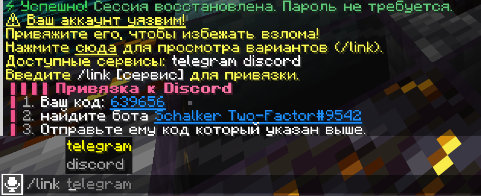
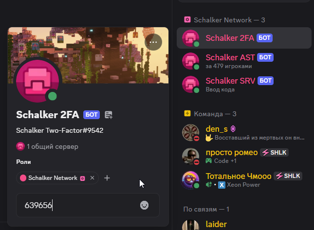
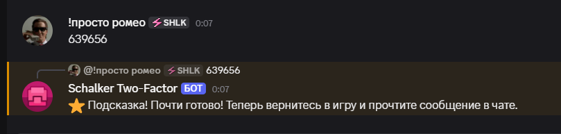
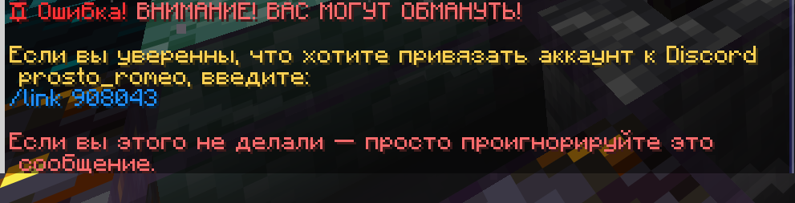
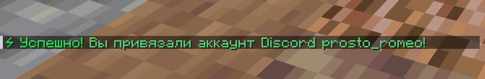
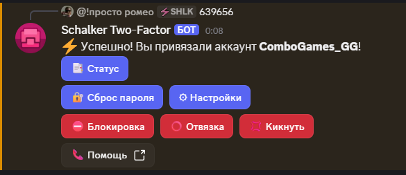
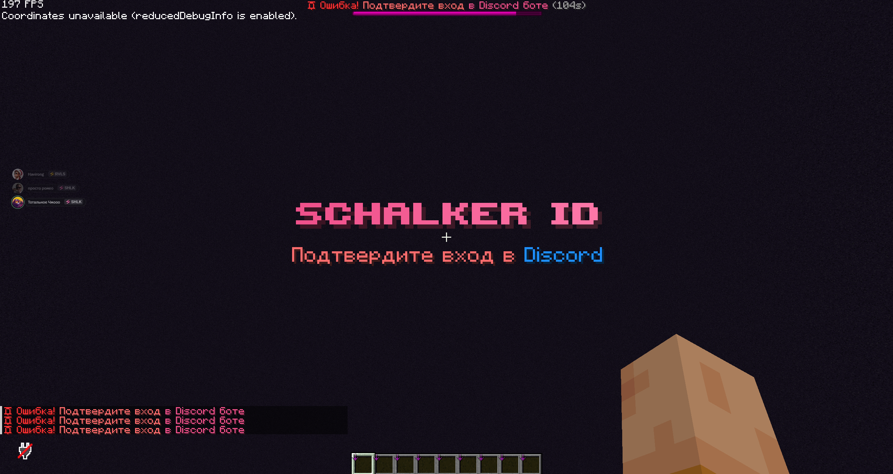
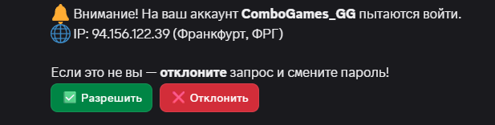

---
title: "Двойная аутентификация"
description: "Безопасность вашего аккаунта."
category: "account"
---

## Есть лицензия

Если у вас лицензионная версия игры, то подключать 2FA не обязательно, но необходимо будет подтвердить свою лицензию. Для этого пропишите команду `/premium`. После подтверждения лицензионного аккаунта вам не нужно будет вводить пароль, а игроки с пиратской версии игры не смогут зайти под вашим ником, так как он не лицензионный. [Гайд на подключение Premium](/wiki/account-premium)

P.S. Если вы боитесь, что у вас могут украсть лицензию, то с лицензионным аккаунтом можно подключить 2FA.

## Нет лицензии

Безопасность вашего аккаунта всегда превыше всего, ведь после взлома вам будет тяжело доказать администрации проекта, что вы были взломаны.

### Инструкция подключения 2FA

1. Присоединяемся на сервер Schalker Vanilla и вводим команду `/link`.
2. Выбираем понравившуюся социальную сеть. На моем примере подключаем дискорд аккаунт командой `/link discord`.
3. Ваc попросит написать шестизначный код боту.
   
4. Пишем код боту.
   
5. Бот скажет вернуться в игру и прочитать сообщение.
   
6. Пишем команду которую он скажет, в моем случае: `/link 908043`
   
7. Готово! Появится уведомление что вы всё сделали правильно и у вас работает 2FA.
   
   

### Как подтвердить вход на сервер?

После ввода сервер попросит подтвердить вход без ввода пароля.

В привязанной социальной сети вам придёт сообщение с просьбой подтвердить вход.

