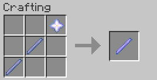

Предмет, используемый для редактирования состояний блоков. Выглядит как стержень бриза, но является палкой отладки со всеми её возможностями.

## Крафт

- **Стержень бриза** × 2
- **Звезда Незера** × 1

## Использование

Палку отладки можно использовать для изменения состояний блоков. Чтобы использовать палку отладки, сначала присыпьте блок светопылью: <kbd>SHIFT</kbd> + <kbd>ПКМ</kbd>. После этого игра даст возможность манипулировать блоком. Чтобы снять напыление, очистите его с помощью любого топора: <kbd>SHIFT</kbd> + <kbd>ПКМ</kbd>.

Удар палкой по блоку позволяет выбрать его редактируемое состояние; например, можно сменить редактируемое состояние с `conditional` (условный) на `facing` (направление) у командного блока. Использование палки на блоке позволяет изменить значение редактируемого состояния; например, можно изменить направление командного блока на юг, изменив значение состояния `facing` на `south`. Если присесть, порядок смены состояний/значений изменится в обратную сторону.

## Ограничения

Палочка отладки **не работает** с некоторыми блоками. При попытке использовать её на таком блоке появится предупреждение.

Изменение состояния `waterlogged` (затопление водой) **запрещено** для всех блоков.

### Заблокированные блоки

<table>
  <thead>
  <tr>
      <th>Блок</th>
      <th>Категория</th>
  </tr>
  </thead>
  <tbody>
  <tr>
      <td>Пчелиное гнездо</td>
      <td>Контейнер</td>
  </tr>
  <tr>
      <td>Улей</td>
      <td>Контейнер</td>
  </tr>
  <tr>
      <td>Пшеница</td>
      <td>Культура</td>
  </tr>
  <tr>
      <td>Морковь</td>
      <td>Культура</td>
  </tr>
  <tr>
      <td>Картофель</td>
      <td>Культура</td>
  </tr>
  <tr>
      <td>Свёкла</td>
      <td>Культура</td>
  </tr>
  <tr>
      <td>Стебель арбуза</td>
      <td>Культура</td>
  </tr>
  <tr>
      <td>Стебель тыквы</td>
      <td>Культура</td>
  </tr>
  <tr>
      <td>Адский нарост</td>
      <td>Культура</td>
  </tr>
  <tr>
      <td>Куст сладких ягод</td>
      <td>Культура</td>
  </tr>
  <tr>
      <td>Пещерные лианы</td>
      <td>Культура</td>
  </tr>
  <tr>
      <td>Какао-бобы</td>
      <td>Культура</td>
  </tr>
  <tr>
      <td>Бамбук</td>
      <td>Культура</td>
  </tr>
  <tr>
      <td>Сахарный тростник</td>
      <td>Культура</td>
  </tr>
  <tr>
      <td>Кактус</td>
      <td>Культура</td>
  </tr>
  <tr>
      <td>Ламинария</td>
      <td>Культура</td>
  </tr>
  <tr>
      <td>Закрученные лианы</td>
      <td>Культура</td>
  </tr>
  <tr>
      <td>Плакучие лианы</td>
      <td>Культура</td>
  </tr>
  <tr>
      <td>Росток факелоцвета</td>
      <td>Культура</td>
  </tr>
  <tr>
      <td>Росток кувшинки</td>
      <td>Культура</td>
  </tr>
  <tr>
      <td>Снег</td>
      <td>Прочее</td>
  </tr>
  <tr>
      <td>Яйцо черепахи</td>
      <td>Прочее</td>
  </tr>
  <tr>
      <td>Яйцо сниффера</td>
      <td>Прочее</td>
  </tr>
  <tr>
      <td>Свечи (все цвета)</td>
      <td>Прочее</td>
  </tr>
  <tr>
      <td>Морской огурец</td>
      <td>Прочее</td>
  </tr>
  </tbody>
</table>

