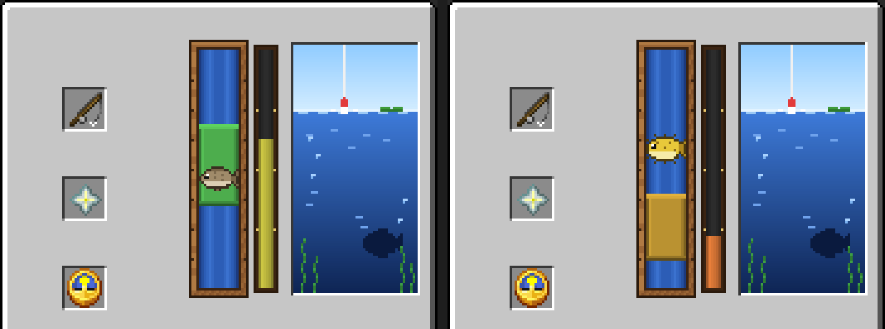
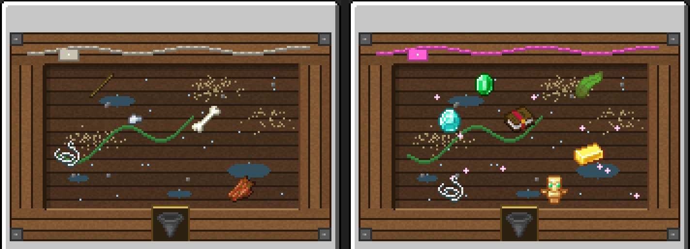

На Schalker каждая поклёвка — это короткая схватка с рыбой, а за удачный улов можно получить **рыболовный мешочек** с находками. Удочка обычная, ничего крафтить не нужно.

## 🎣 Как работает рыбалка

1. Забросьте удочку. Когда клюёт, появится подсказка **«Клюёт! Подсекайте!»**.
2. Подсеките (<kbd>ПКМ</kbd>) — откроется мини-игра.
3. **Кликайте по меню**, чтобы поднимать зелёную зону, без кликов она падает. Держите рыбу внутри зоны, пока шкала прогресса не заполнится.

Рыба вне зоны — прогресс падает. Шкала опустела или прошло 60 секунд — рыба сорвалась, и вы ничего не получаете. Закрыли окно, погибли или телепортировались — улов тоже пропадает.

Улов определяется в момент подсечки по обычным правилам Minecraft, мини-игра решает только, вытащите вы его или нет.

### Сложность

Сложность зависит от того, что на крючке. Она видна в заголовке окна и по значку рыбы.

| Сложность | Что на крючке |
|---|---|
| **Лёгкая** — треска | Треска и почти весь мусор |
| **Обычная** — лосось | Лосось и прочее |
| **Сложная** — тропическая рыба | Тропическая рыба, иглобрюх, раковина наутилуса, бирка, седло и любой зачарованный улов |

Чем сложнее, тем меньше зона и быстрее рыба.

### Качество улова

Качество не меняет улов, но повышает шанс бонусного мешочка.

| Качество | Условие | Шанс мешочка |
|---|---|---|
| ✦ **Идеальный** | Рыба ни разу не вышла из зоны | **37,5%** |
| ✧ **Хороший** | Рыба в зоне не меньше 80% времени | **31,25%** |
| Обычный | Всё остальное | **25%** |

## 🎒 Рыболовные мешочки

Мешочек — это **дополнительная** награда за победу в мини-игре, улов вы получаете в любом случае. Внутри сразу несколько предметов: от мусора и ресурсов до алмазов, зачарованных книг и сокровищ.

| Мешочек | Шанс редкости | Предметов |
|---|---|---|
|  **Обычный** | 50% | 2–6 |
|  **Необычный** | 26% | 2–7 |
|  **Редкий** | 14% | 3–8 |
|  **Эпический** | 7% | 4–8 |
|  **Легендарный** | 2,5% | 4–9 |
|  **Мифический** | 0,5% | 5–10 |

Чем выше редкость, тем больше предметов и ценнее находки. Идеальный улов повышает только шанс выпадения мешочка, на редкость он не влияет. Начиная с Редкого, в мешочке может попасться книга **«Починка I»** — подробнее на странице [Добыча починки](/wiki/mending).

### Открытие

Возьмите мешочек в руку и нажмите <kbd>ПКМ</kbd> (у сундука или двери — с <kbd>Shift</kbd>).

Находки по одной появляются на дне ящика, самые ценные — последними, с меткой **✦ Редкая находка** или **✦ Сокровище!**. Забирайте их кликом или кнопкой **«Забрать всё»**. Если закрыть ящик раньше, всё невзятое само переложится в инвентарь.
