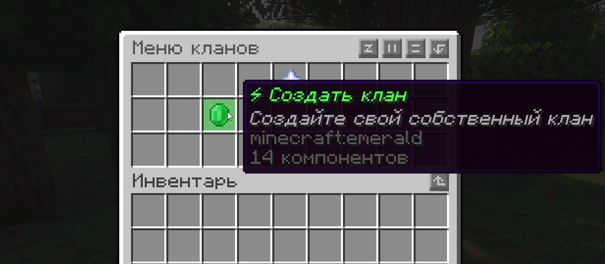
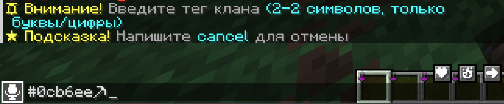

Я исправил грамматические ошибки (например, «аналагично», «присоедениться»), перевел HTML-таблицы в чистый Markdown для лучшей читаемости, добавил эмодзи для навигации и структурировал информацию.

---

# 🛡️ Система Гильдий Schalker Vanilla

> **Описание:** Здесь описаны возможности уникальной системы гильдий сервера.
> **Категория:** Gameplay

---

## 🏗️ Создание клана

1. Откройте меню командой `/clan` и нажмите **«Создать клан»**, либо используйте команду `/clan create`.
2. Введите **тег клана** в чат.
3. Введите **название клана** в чат.
4. Дождитесь сообщения об успешном создании.
5. *Для отмены создания напишите `cancel` или `отмена`.*

### 🎨 Требования к оформлению

| Поле | Правила и ограничения |
| :--- | :--- |
| **Тег клана** | • Длина: **1–2 символа**. • Без пробелов. • Должен быть уникальным. • Разрешены: буквы, цифры, символ `❤`, а также цветовые коды (например, `#0cb6ee`, `&`). |
| **Название** | • Длина: **3–10 символов**. • Должно быть уникальным (как и тег). • Разрешены цветовые коды (`&`). |

---

## 🤝 Вступление в клан

### Способ 1: Самостоятельно (через список)
1. Введите `/clan list` для просмотра списка кланов.
2. Выберите понравившийся клан.
3. В профиле нажмите кнопку **«Вступить»** (доступно только для кланов со статусом *Public*).

### Способ 2: По приглашению
1. Игрок с правами приглашения пишет: `/clan invite <ВашНик>`.
2. Вы получаете уведомление в чате.
3. Нажмите кнопку **[Принять]** в сообщении или введите `/clan accept`.

---

## 📜 Основные правила и ограничения

| Правило | Описание |
| :--- | :--- |
| **Лимит участников** | В каждом клане существует ограничение на максимальное количество бойцов. |
| **Лидерство** | Лидер **не может выйти** из клана. Он обязан либо передать лидерство другому игроку, либо расформировать клан. |
| **Цензура** | Запрещено использовать в названиях и тегах символы/слова, нарушающие общие правила сервера (оскорбления, свастика и т.д.). |

---

## 🔒 Приватность и настройки

Вы можете менять статус доступа к клану через меню настроек или командой `/clan privacy`:

*   🔓 **Public** — любой игрок может вступить через профиль клана.
*   📩 **Invite Only** — вступление возможно только по приглашению.
*   🕵️ **Private** — клан скрыт в общем списке, профиль виден только участникам.

### ⚙️ Меню настроек (GUI)
В разделе настроек лидер может изменить:
*   Приватность клана.
*   Название и тег (через чат).
*   Описание клана.
*   Цвет баннера.
*   Отображение тега.
*   Публичность профиля.
*   Режим **Friendly Fire** (огонь по своим).

---

## 💬 Клановый чат

Общайтесь с соклановцами, не мешая другим игрокам.

*   **Включение:** Лидер может включить/выключить чат командой `/clan chat`.
*   **Использование:** Отправляйте сообщения, начиная их с символа `*`.
    *   *Пример:* `* Всем привет, идем на рейд!`

---

## 👑 Роли и иерархия

Управление ролями доступно через GUI «Управление ролями» или командой `/clan role assign`.

| Роль | Права |
| :--- | :--- |
| ⭐ **Leader** | Полный доступ ко всем настройкам и управлению. |
| ⚔️ **Co-Leader** | Все права, кроме расформирования клана. |
| 🛡️ **Moderator** | Может приглашать новых игроков и исключать нарушителей. |
| 👤 **Member** | Базовый участник без прав управления. |

---

## ❓ FAQ (Частые вопросы)

**В: Почему я не могу вступить в клан?**
О: Либо в клане достигнут лимит участников, либо вы уже состоите в другом клане.

**В: Почему не получается кикнуть игрока?**
О: У вас недостаточно прав, либо вы пытаетесь исключить игрока с ролью равной или выше вашей.

**В: Почему я не вижу клан в списке `/clan list`?**
О: Скорее всего, у клана установлен статус **Private** (скрытый).

**В: Что такое Friendly Fire?**
О: Это настройка "Огонь по своим". Если она выключена, участники одного клана не могут наносить урон друг другу (мечом, стрелами и т.д.).

---

## 💻 Список команд

### Для всех участников
| Команда | Описание |
| :--- | :--- |
| `/clan` или `/clan menu` | Открыть главное меню. |
| `/clan list` | Список всех публичных кланов (+ ваш, если он приватный). |
| `/clan profile [тег]` | Посмотреть профиль клана (своего или чужого по тегу). |
| `/clan leave` | Покинуть текущий клан (недоступно Лидеру). |
| `/clan accept <игрок>` | Принять приглашение. |
| `/clan deny <игрок>` | Отклонить приглашение. |

### Для Лидера и офицеров
| Команда | Описание |
| :--- | :--- |
| `/clan invite <игрок>` | Пригласить игрока в клан. |
| `/clan kick <игрок>` | Исключить игрока из клана. |
| `/clan promote <игрок>` | Передать права Лидера (требует подтверждения). |
| `/clan disband` | Расформировать (удалить) клан навсегда. |
| `/clan privacy <режим>` | Установить режим: `public`, `private`, `invite_only`. |
| `/clan setname <имя>` | Сменить название клана. |
| `/clan settag <тег>` | Сменить тег клана. |
| `/clan chat` | Вкл/выкл клановый чат (глобально). |
| `/clan role assign <ник> <id>` | Назначить роль участнику. |
