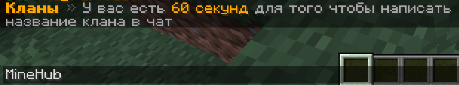
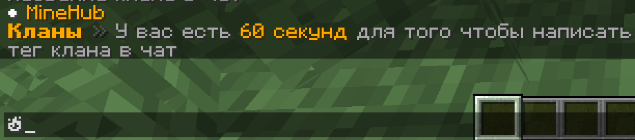
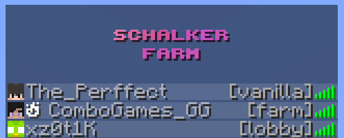
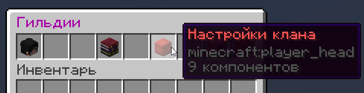
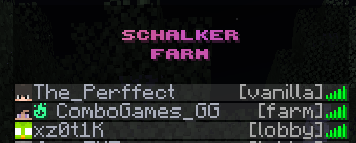

### Команды для обычных игроков

<table>
    <thead>
        <tr>
            <th>Команда</th>
            <th>Назначение</th>
        </tr>
    </thead>
    <tbody>
    <tr>
        <td><code>/clan leave</code></td>
        <td>Покинуть гильдию</td>
    </tr>
    <tr>
        <td><code>/clan join [имя клана]</code></td>
        <td>Вступить в гильдию</td>
    </tr>
    <tr>
        <td><code>/clan</code></td>
        <td>Меню гильдии</td>
    </tr>
    </tbody>
</table>

### Правила создания гильдий

<table>
    <thead>
        <tr>
            <th>Правило</th>
            <th>Описание</th>
        </tr>
    </thead>
    <tbody>
        <tr>
            <td>Запретные символы в теге</td>
            <td>В теге не должны быть символы оскорбляющие других людей.</td>
        </tr>
        <tr>
            <td>Нельзя вступить в две гильдии сразу</td>
            <td>Вступившие игроки не имеют право создавать свои гильдии. Для этого они должны покинуть существующую.</td>
        </tr>
    </tbody>
</table>

### Первое — создание гильдии в майнкрафте

1. Гильдию может создать каждый игрок.
2. Пропишите команду `/clan`
3. Появится менюшка в которой жмите `ЛКМ: Создать клан`
4. Вам напишет "Введите название гильдии". Пример: `MineHub`

5. Далее напишет "Введите тег". Пример: `🔥`

6. Как только вам напишет "Вы создали клан" - поздравляю вы создали гильдию!
7. Через время появится значек вашей гильдии в табе!

### Второе — как поменять цвет тега в табе?

1. Пропишите команду `/clan`
2. Появится менюшка в которой жмите `ЛКМ: Настройка клана`

3. Дальше жмите `ЛКМ: Выбрать цвет тега`
4. Выберайте цвет и ура-ура, цвет поменян

### Команды для главы гильдии

<table>
    <thead>
        <tr>
            <th>Команда</th>
            <th>Назначение</th>
        </tr>
    </thead>
    <tbody>
        <tr>
            <td><code>/clan kick [Ник]</code></td>
            <td>Исключить игрока из гильдии.</td>
        </tr>
        <tr>
            <td><code>/clan promote [ник]</code></td>
            <td>Повысить игрока гильдии до заместителя.</td>
        </tr>
        <tr>
            <td><code>/clan demote [ник]</code></td>
            <td>Понизить игрока гильдии до участника.</td>
        </tr>
        <tr>
            <td><code>/clan delete</code></td>
            <td>Расформировать гильдию.</td>
        </tr>
    </tbody>
</table>
