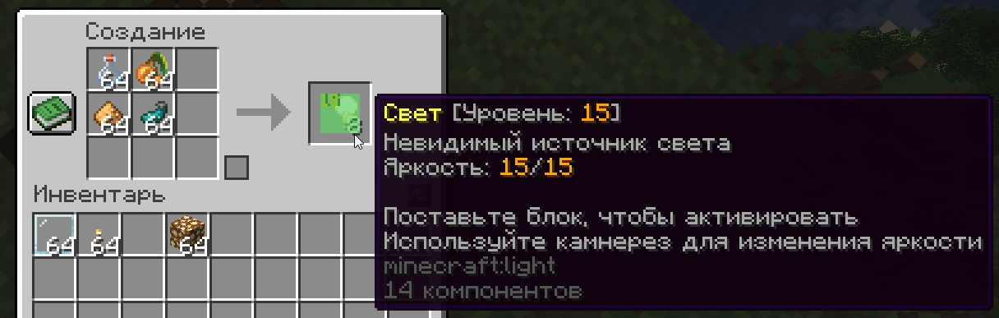
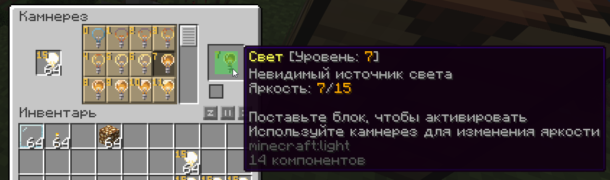

## Крафт

Для крафта блока света нужны:
- 1 пустой бутылек
- 1 светящаяся ягода
- 1 светокаменная пыль
- 1 светящийся чернильный мешок

## Использование

Каждый блок света (как блок или как предмет) имеет собственный уровень света, который может быть в диапазоне от 0 до 15. В инвентаре уровень освещения блока света отображается в верхнем левом углу, и чем выше уровень освещения, тем «ярче» выглядят эти блоки.

При размещении в виде блока, блоки света не являются твёрдыми и полностью невидимы.

Блокам светам можно выбрать уровень света в камнерезе.

