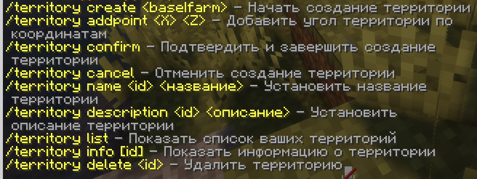
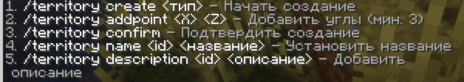
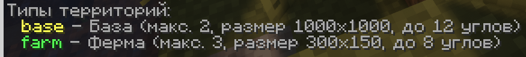

## Описание

Вы сможете занимать территории прямо в игре. (не приватить, а занимать)
Территория - ваше занятое место, где вы можете устанавливать свои правила (кроме бредовых по типу вход = штраф 100 аров и т.д.). Занятая территория физически не дает никаких ограничений другим игрокам.

**Есть ограничение занятия территории:**

- С момента удаления территории должно пройти 3 дня, чтобы создать новую

## Видео гайд

<YouTube url="https://www.youtube.com/watch?v=sC77NPaOmqE" />

## Команды 

**Команды территорий**

**Процесс создания территории**

## Типы территорий

*P.S. Можете не обращать внимание на тип территории. Это обычная пометка. Вы можете создать на типе "ферм" свою базу, а на типе "базы" ферму.*