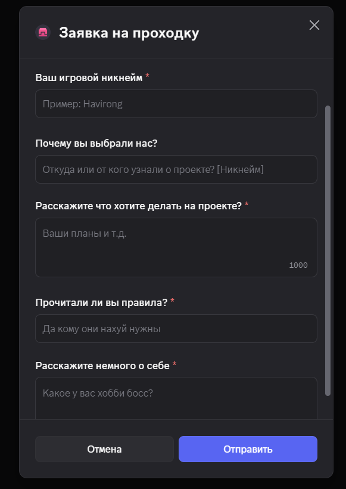
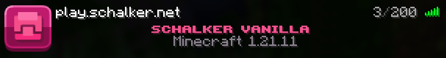
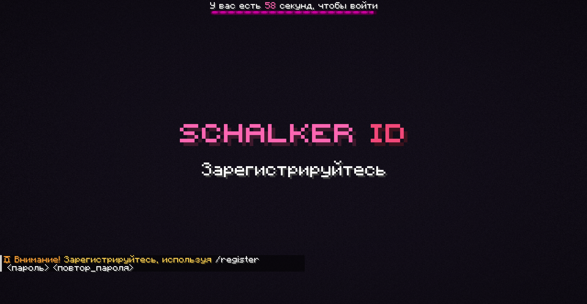
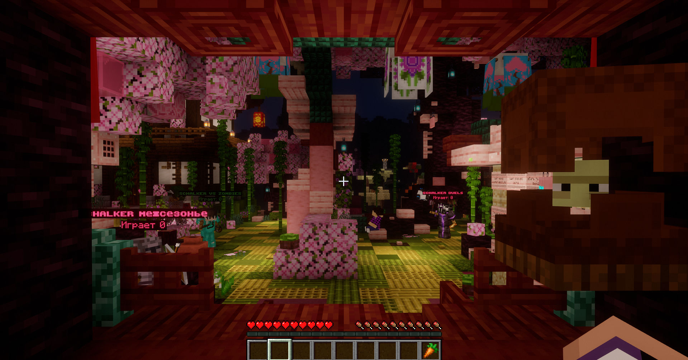
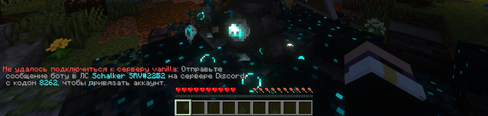
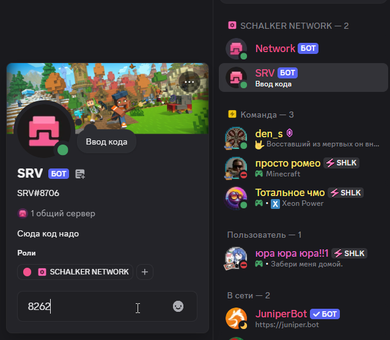

### Как начать играть на проекте Schalker Vanilla?

Schalker — Это приватный, ванильный сервер созданный для ламповой и cплoчённой игры людей. На сервере нет привата территорий, лишних плагинов и привилегий. На сервер можно зайти с пиратской и лицензионной версии игры.

Перед началом обязательно прочитайте Правила и Информацию в нашем [Discord сервере](https://discord.gg/schalker)

### Первое — с чего начать?

1. Присоединиться к серверу [Discord](https://discord.gg/schalker)
2. Заполнить заявку и ждать одобрения.

3. Добавление в вайтлист после принятия происходит автоматически, вы сразу же сможете зайти!

### Второе — как зайти?

1. Подключиться к серверу на версии указанной в канале Информации

2. Зарегистрироваться или войти в аккаунт

### Команды авторизации

| Команда | Назначение |
|---------|------------|
| `/register` | Регистрация аккаунта |
| `/login` | Вход в аккаунт |

3. Вас перекинет в лобби нашего сервера
4. Нажмите по человеку с именем Schalker Vanilla

5. Вас попросит привязать аккаунт дискорда (это не сложно)
6. Вам при нажатии отправят четырехзначный код в чат. Его нужно отправить боту SRV#8706 в личные сообщения.

7. Если бот ответил что "Ваш Discord аккаунт был успешно привязан к Minecraft-аккаунту" то вы сделали всё правильно, поздравляю!

### Приятной игры!
