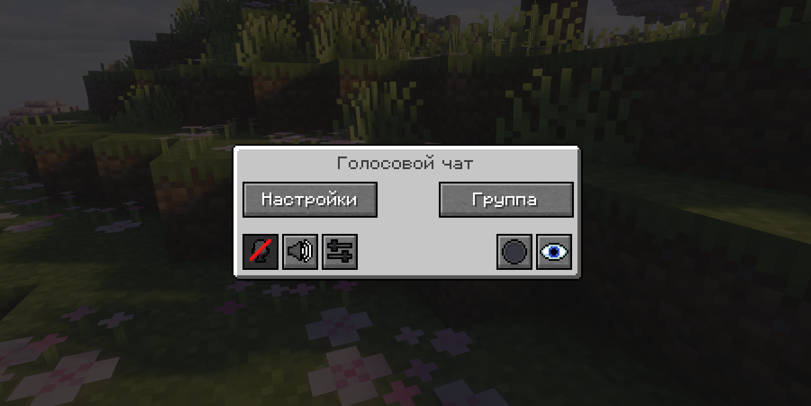
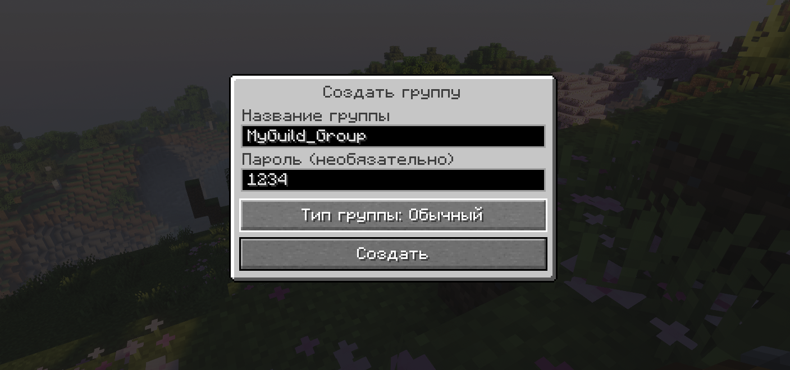
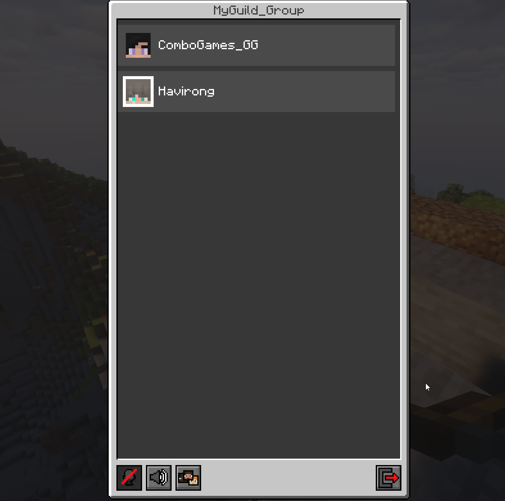
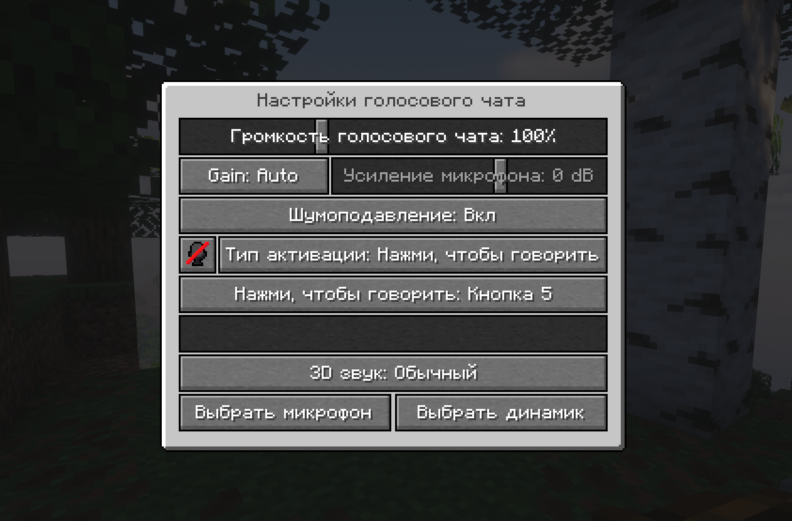

## Установка

Инструкция по установке будет добавлена позже.

# Simple Voice Chat

## [Скачать мод](https://modrinth.com/plugin/simple-voice-chat/versions?l=fabric)

## Иконки

<table>
    <thead>
        <tr>
            <th>Иконка</th>
            <th>Описание</th>
        </tr>
    </thead>
    <tbody>
        <tr>
            <td></td>
            <td>Вы говорите</td>
        </tr>
        <tr>
            <td></td>
            <td>Вы шепчете</td>
        </tr>
        <tr>
            <td></td>
            <td>Игрок говорит</td>
        </tr>
        <tr>
            <td></td>
            <td>Игрок шепчет</td>
        </tr>
        <tr>
            <td></td>
            <td>Микрофон отключен</td>
        </tr>
        <tr>
            <td></td>
            <td>Голосовой чат отключен</td>
        </tr>
        <tr>
            <td></td>
            <td>Голосовой чат не подключен или не установлен</td>
        </tr>
    </tbody>
</table>

## Интерфейс

Окно голосового чата можно открыть, нажав клавишу <kbd>V</kbd>. Через него можно:

- Открыть настройки
- Управлять групповыми чатами
- Выключить/включить микрофон
- Отключить голосовой чат
- Начать или остановить запись
- Скрыть все иконки

## Групповые чаты

Групповые чаты позволяют общаться с игроками, которые находятся не рядом с вами.

1. Чтобы открыть интерфейс группового чата, нажмите кнопку группы в окне голосового чата или используйте клавишу
группового чата.

2. Для создания новой группы введите имя в текстовое поле и нажмите кнопку внизу.

После создания или присоединения к группе вы попадете в интерфейс группового чата. В левом верхнем углу экрана будут
отображаться аватары участников группы. Говорящие игроки будут выделены. Эти иконки можно отключить, нажав третью кнопку
слева.

Игроки, которые не находятся в группе, увидят иконку группы над вашей головой, показывающую, что вы в группе.

Пригласить игроков в групповой чат можно командой:

`/voicechat invite <имя_игрока>`

или через экран социальных взаимодействий.

## Настройки

Чтобы открыть настройки голосового чата, нажмите **V** и кнопку настроек.

В меню настроек можно:

- Настроить аудио голосового чата

- Проверить работу микрофона, нажав кнопку микрофона

## Аддоны

### [Voice Messages](https://modrinth.com/plugin/voicemessages)

Голосовые сообщения прямо в чате майнкрафта