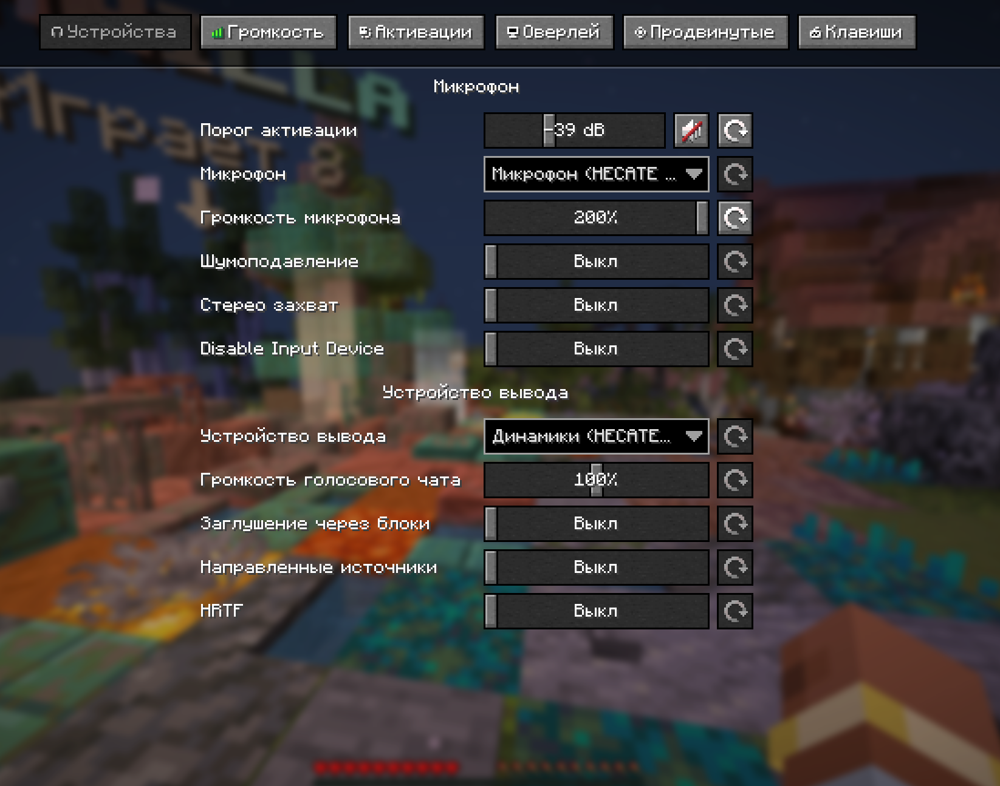
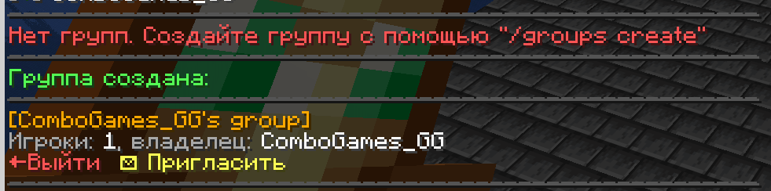

## Установка

Инструкция по установке будет добавлена позже.

# Simple Voice Chat

[Скачать мод](https://modrinth.com/plugin/simple-voice-chat/versions?l=fabric)

## Иконки

## Интерфейс

Окно голосового чата можно открыть, нажав клавишу <kbd>V</kbd>. Через него можно:

- Открыть настройки
- Выключить/включить микрофон
- Отключить голосовой чат
- Настроить громкость игроков
- Настроить громкость проигрывателей

## Групповые чаты

Групповые чаты позволяют общаться с игроками, которые находятся не рядом с вами.

1. Чтобы открыть интерфейс группового чата, нажмите кнопку группы в окне голосового чата или используйте клавишу
группового чата.

2. Для создания новой группы введите имя в текстовое поле и нажмите кнопку внизу.

## Дефолтные бинды кнопок

## Аддоны

[SoundPhysics](https://modrinth.com/mod/pv-addon-soundphysics)
Добавляет совместимость с Sound Physics Remastered. На Plasmo Voice влияют законы физики звука.

[Talking Heads](https://modrinth.com/mod/talkingheads)
Клиентский аддон для PlasmoVoice и SimpleVoiceChat, изменяющий размер головы игроков во время разговора.